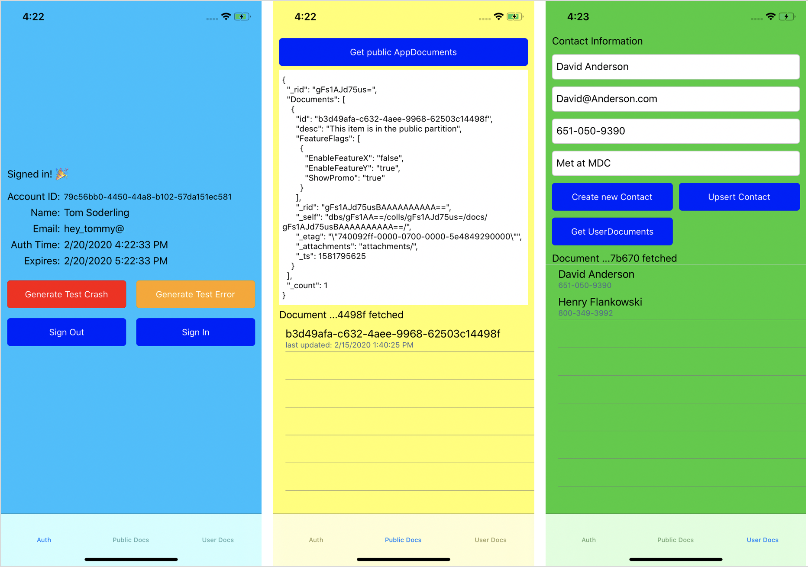

# Mobile Backend with Azure AD B2C & Cosmos DB

Demo Xamarin.Forms app showing the power of Azure AD B2C & Cosmos DB to build a mobile backend for pennies.

See repo for slides that go along with the app

## Using this sample app
You'll need to provide your own configuration values for your Cosmos DB account 
 
